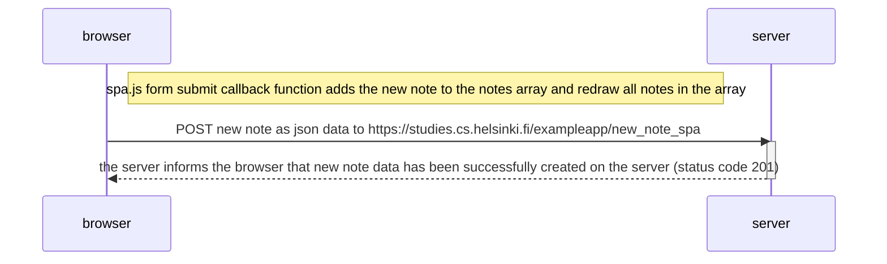

```mermaid
sequenceDiagram
    participant browser
    participant server

    Note right of browser: spa.js form submit callback function adds the new note to the notes array and redraw all notes in the array

    browser->>server: POST new note as json data to https://studies.cs.helsinki.fi/exampleapp/new_note_spa
    activate server
    server-->>browser: the server informs the browser that new note data has been successfully created on the server (status code 201)
    deactivate server
```
